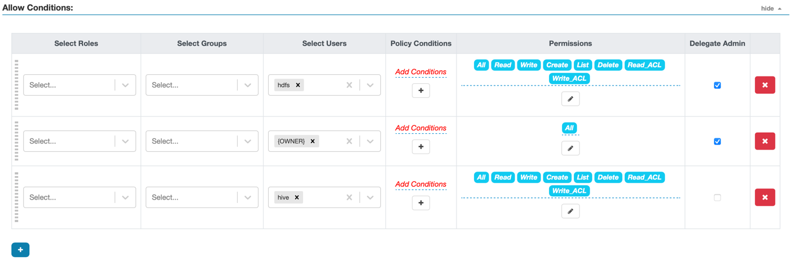

# Resource Mapping Manager demo cluster

## Prerequisites

- Java 8
- Maven
- Docker

## Configuration

In order to change configuration options for any service add/modify them in the corresponding file in the `conf/` directory.

## HDFS demo cluster

### Start cluster

1. From the repository root run the following command to build and start Ranger Admin and other auxiliary services
```shell
env DOCKER_MAVEN_BUILD=1 RANGER_REBUILD=1 ./ranger_in_docker up
```
2. Go to the demo directory
```shell
cd ./dev-support/resource-mapping-manager
```
3. Run the following script to start Resource Mapping Manager and HDFS with enabled Ranger Hive Chained Plugin
```shell
./bin/rmm-cluster.sh start --service=hdfs
```
4. Create some Hive DB and table
```shell
./bin/rmm-cluster.sh beeline --service=hdfs
create database db1;
create table db1.table1(i int);
!q
```
5. Wait some time and try to access table directory in HDFS
```shell
 docker compose -f "docker-compose-rmm-hdfs.yaml" exec -it ranger-hadoop hdfs dfs -ls /user/hive/warehouse/db1.db/table1
```
It should return something like
```
ls: org.apache.ranger.authorization.hadoop.exceptions.RangerAccessControlException: Permission denied: user=root, access=EXECUTE, inode="/user/hive/warehouse/db1.db/table1"
```

### Stop cluster
1. Go to the demo directory
```shell
cd ./dev-support/resource-mapping-manager
```
2. Run the following command to stop Resource Mapping Manager cluster
```shell
./bin/rmm-cluster.sh stop --service=hdfs
```
3. Return to the project root directory
```shell
cd ../../
```
4. Stop Ranger Admin cluster
```shell
./ranger_in_docker down
```

## Ozone demo cluster

### Start cluster

1. From the repository root run the following command to build and start Ranger Admin and other auxiliary services
```shell
env DOCKER_MAVEN_BUILD=1 RANGER_REBUILD=1 ./ranger_in_docker up
```
2. Run init scripts
```shell
cd  ./dev-support/ranger-docker/
./scripts/ozone-plugin-docker-setup.sh
```
3. Wait until `dev_ozone` is added and grant all permissions to the user `hive` in the `all - volume, bucket, key` policy of the `dev_ozone` service in [Ranger WebUI](http://localhost:6080) (credentials admin/rangerR0cks!)

4. Go to the demo directory
```shell
cd ../resource-mapping-manager
```
3. Run the following script to start Resource Mapping Manager and HDFS with enabled Ranger Hive Chained Plugin
```shell
./bin/rmm-cluster.sh start --service=ozone
```
4. Create some Hive DB and table
```shell
./bin/rmm-cluster.sh beeline --service=ozone
create database db1;
create table db1.table1(i int);
!q
```
5. Wait some time and try to access table directory in Ozone
```shell
 docker compose -f "docker-compose-rmm-hdfs.yaml" exec -it ozone-om sudo -E -u hadoop /opt/hadoop/bin/ozone fs -ls ofs://om/vol1/bucket1/warehouse/db1.db/table1
```
It should return something like
```
ls: User hadoop doesn't have READ permission to access key Volume:vol1 Bucket:bucket1 Key:warehouse/db1.db/table1
```

### Stop cluster
1. Go to the demo directory
```shell
cd ./dev-support/resource-mapping-manager
```
2. Run the following command to stop Resource Mapping Manager cluster
```shell
./bin/rmm-cluster.sh stop --service=ozone
```
3. Return to the project root directory
```shell
cd ../../
```
4. Stop Ranger Admin cluster
```shell
./ranger_in_docker down
```
